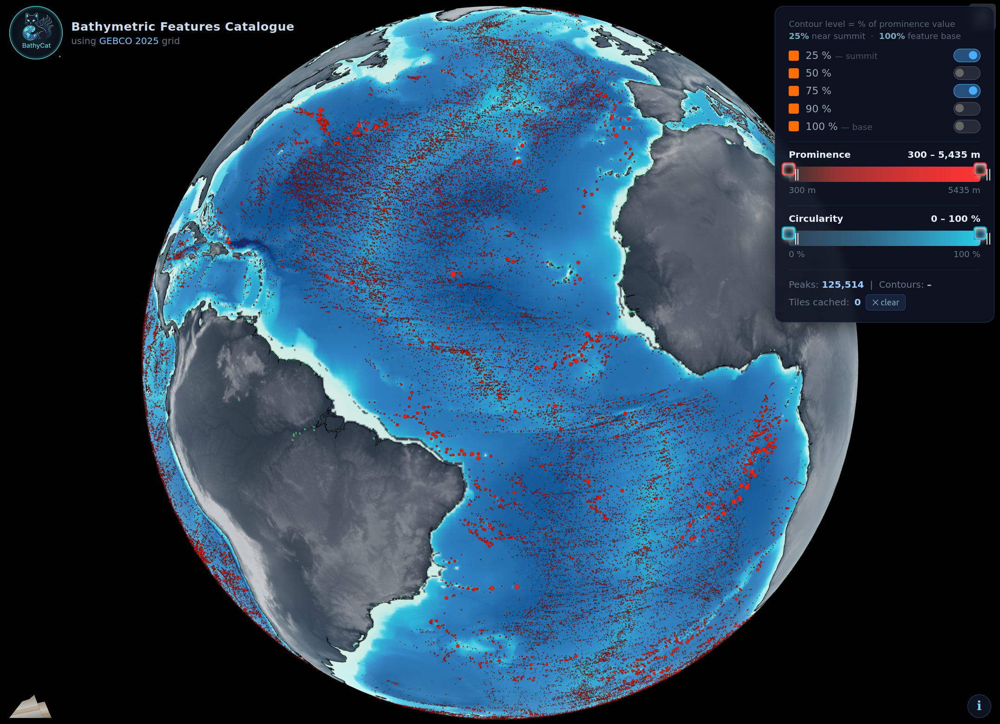

# Bathymetric Features Delineation and Analysis

This repository contains the code and processing pipeline used to produce the global bathymetric feature dataset published in [](#citation) and archived on [](https://doi.org/10.1594/PANGAEA.992546). The dataset GeoPackages can be explored in any GIS software or through our web interface [BathyCat](https://bathycat.bergwerk.com/).

<p align="center"></p>

Earth's ocean floor hosts hundreds of thousands of underwater mountains, including seamounts, knolls, and ridges, the majority of which remain poorly mapped. This pipeline produces a comprehensive global catalogue of such features derived from **[GEBCO](https://www.gebco.net)** (General Bathymetric Chart of the Oceans) global bathymetric grids, with example workflows provided for both the GEBCO 2014 (30 arc-second) and GEBCO 2025 (15 arc-second) releases.

Our analysis builds upon **[Mountains](https://github.com/akirmse/mountains)** (Kirmse & de Ferranti, 2017, see [Citations](#citation)), a prominence calculation engine that identifies bathymetric peaks and determines each feature's topographic prominence by locating its key saddle. Around each identified peak, multi-level contours are extracted at 100%, 90%, 75%, 50%, and 25% of its prominence, outlining the feature's shape across progressively broader scales. For each contour, a set of spatial metrics is computed, including area, circularity, orientation, dimensions, and slope statistics, providing the quantitative basis for systematic and objective characterisation of seafloor features. The pipeline produces GeoPackage outputs ready for visualization and further analysis.

> **Citation:** If you use this pipeline or its outputs, please cite our publications in [](#citation) and [](https://doi.org/10.1594/PANGAEA.992546) and the underlying tools (Mountains and GEBCO, see [Citations](#citation) below).

## Overview

This pipeline processes bathymetric data to:
1. Identify bathymetric peaks and calculate their topographic prominence using the [Mountains](https://github.com/akirmse/mountains) tool
2. Extract multi-level contours around each feature and compute all the spatial metrics
3. Generate GeoPackage outputs for visualization

## Repository Structure

```
Bathymetric_Features/
├── code/                           # Python processing scripts
│   ├── mountains/                  # Git submodule (not included in repo)
│   ├── organize_prominence_results.py
│   ├── find_ctrs.py
│   └── cluster_ctrs.py
├── data/                           # Data directory (input/output)
│   ├── input/                      # Input bathymetry files (user-provided)
│   └── output/                     # Processing results
├── environment.yml                 # Conda environment specification
├── run_GEBCO_2014_30s.sh          # GEBCO 2014 workflow
└── run_GEBCO_2025_15s.sh          # GEBCO 2025 workflow
```

## Quick Start

For users cloning this repository for the first time:

```bash
# 1. Clone with submodules
git clone --recurse-submodules https://github.com/bergwerk-com/Bathymetric_Features.git
cd Bathymetric_Features

# 2. Set up conda environment
conda env create -f environment.yml
conda activate BathyFeatures

# 3. Compile Mountains binary (here for OSX and gcc, see [Mountains](https://github.com/akirmse/mountains) repository for Windows)
cd code/mountains/code && make
cd ../../../../  # Return to repository root

# 4. Run a workflow
./run_GEBCO_2014_30s.sh
```

## Installation

### 1. Clone the Repository with Submodules

This pipeline uses the Mountains prominence calculation tool by Adam Kirmse for detecting topographic peaks and calculating their prominence. To clone this repository along with the Mountains prominence calculation tool, use:

```bash
# Clone the repository and initialize the mountains submodule in one command
git clone --recurse-submodules https://github.com/bergwerk-com/Bathymetric_Features.git

# Or if you've already cloned without --recurse-submodules:
cd Bathymetric_Features
git submodule update --init --recursive
```

This will automatically clone the [Mountains](https://github.com/akirmse/mountains) repository into `code/mountains/`.

### 2. Install Software Dependencies

The easiest way to install all dependencies is using conda:

```bash
# Create the environment from the provided file
conda env create -f environment.yml

# Activate the environment
conda activate BathyFeaturesCtrs
```

The `environment.yml` file includes:
- Python 3.11 with geospatial packages:
  - `geopandas` - Geospatial data manipulation
  - `rasterio` - Raster I/O with GDAL
  - `gdal` - GDAL command-line tools and Python bindings
  - `contourpy` - Fast contour generation
  - `shapely` - Geometric operations
  - `pyproj` - Coordinate transformations
  - `numpy` - Numerical operations
  - `pandas` - Data manipulation
  - `xarray` - NetCDF file handling
  - `netcdf4` - NetCDF backend for xarray
  - `tqdm` - Progress bars

### 3. Compile Mountains Binary

After cloning the repository as a submodule, compile the Mountains prominence calculation tool:

```bash
cd code/mountains/code
make -j$(nproc)
```

The compiled binary will be available at `code/mountains/code/release/`, which is where the bash scripts expect it.

**Verify the installation:**

```bash
# From the release directory
./divide_tree --help

# Or from the repository root
code/mountains/code/release/divide_tree --help
```
You should see the help message for the Mountains prominence calculation tool.


**Alternative: Use Existing Installation**

If you already have Mountains compiled elsewhere, you can either:
1. Create a symbolic link: `ln -s /path/to/your/mountains code/mountains`
2. Modify the `--binary_dir` parameter in the bash scripts to point to your installation

## Pipeline Workflow

### Step 1: Bathymetry Preprocessing

Convert and filter bathymetric data to appropriate format:

```bash
# For NetCDF input (GEBCO datasets)
gdal_translate -of EHdr -ot Float32 NETCDF:"input.nc":elevation output_full.flt

# Filter to bathymetry only (values <= 0)
gdal_calc.py -A output_full.flt \
    --outfile=output_bathy.flt \
    --calc="A*(A<=0)" \
    --NoDataValue=-32768 \
    --format=EHdr \
    --overwrite

# Build pyramids for visualization
gdaladdo output_bathy.flt 2 4 8 16 32
```

### Step 2: Peak Detection & Prominence Calculation

Calculate topographic prominence using the Mountains algorithm:

```bash
python code/mountains/scripts/run_prominence.py \
    --binary_dir code/mountains/code/release \
    --threads 18 \
    --degrees_per_tile 1 \
    --samples_per_tile 120 \
    --skip_boundary \
    --min_prominence 300 \
    --bathymetry \
    input_bathy.flt
```

**Key Parameters:**
- `--samples_per_tile`: Grid points per degree (120 for GEBCO 30s, 240 for GEBCO 15s)
- `--min_prominence`: Minimum prominence threshold in meters
- `--bathymetry`: Flag for underwater features

### Step 3: Organize Results, Filter and Relocate Peaks

Sort, filter and process prominence calculation outputs, then relocate peaks to exact local maxima (corrects for tiling artifacts):

```bash
python code/organize_prominence_results.py \
    --folder_prominence_results prominence/ \
    --folder_organised_results data/output/OUTPUT_FOLDER/ \
    --bathymetry_file input_bathy.flt \
    --window_size 5
```

This step:
- Converts results.txt to geopackage format
- Filters invalid peaks (islands at elevation = 0, continent margin artifacts)
- Relocates peaks to local bathymetry maxima within a search window
- Saves final peak locations with relocation metadata

### Step 4: Multi-Level Contour Extraction

Extract contours at multiple prominence levels (100%, 90%, 75%, 50%, 25%):

```bash
python code/find_ctrs.py \
    --dem_file input.nc \
    --gpkg_file data/output/OUTPUT_FOLDER/bathymetry_features_peaks.gpkg \
    --window_size_min 1 \
    --window_size_max 25 \
    --enable_dateline_stitching \
    --batch_size 5000 \
    --num_workers 18
```

**Key Parameters:**
- `--window_size_min/max`: Adaptive window sizing (degrees) for contour search
- `--enable_dateline_stitching`: Enable for features crossing ±180° longitude (can lead to visualization issues on UTM maps)
- `--batch_size`: Number of features per batch (memory optimization)
- `--num_workers`: Parallel processing groups/threads

**Supported Formats:**
- NetCDF (`.nc`)
- GeoTIFF (`.tif`, `.tiff`)
- VRT (`.vrt`)

**⚠️ CRITICAL: Window Size Parameter**

The `--window_size_max` parameter is **critical for runtime performance**. The value of 25° was used for global datasets to ensure large plateau-like features are captured, but this results in significantly longer processing times. For regional/local analysis, decrease this value to 5-10° adequatly. The algorithm adaptively searches from `window_size_min` to `window_size_max` until all contours are found. Larger max values mean more iterations and exponentially more data loading per feature.

### Step 5: Nesting Analysis & Hierarchical Clustering

Detect feature nesting relationships and prepare for visualization:

```bash
python code/cluster_ctrs.py \
    --input_gpkg data/output/OUTPUT_FOLDER/contours.gpkg \
    --output_gpkg data/output/OUTPUT_FOLDER/bathymetry_features.gpkg \
    --tile_buffer_degrees 45
```

This step:
- Identifies which features are nested within larger features
- Sorts contours for proper rendering in QGIS (largest → smallest)
- Adds `nested_on_feature_id` attribute for hierarchical relationships

## Example Workflows

Two complete workflow scripts are provided in the repository root. These scripts demonstrate the entire pipeline from bathymetry preprocessing to final outputs using GEBCO global datasets.

### GEBCO 2014 (30 arc-second resolution)

```bash
./run_GEBCO_2014_30s.sh
```

**Configuration:**
- Resolution: 30 arc-seconds (~900m at equator)
- Samples per tile: 120 points/degree
- Output: `data/output/GEBCO2014_30s_1deg120pts/`

### GEBCO 2025 (15 arc-second resolution)

```bash
./run_GEBCO_2025_15s.sh
```

**Configuration:**
- Resolution: 15 arc-seconds (~450m at equator)
- Samples per tile: 240 points/degree
- Output: `data/output/GEBCO2025_15s_1deg240pts/`


## Output Files

Each workflow produces the following outputs in the specified folder:

### Final Outputs
- `bathymetry_peaks.gpkg` - Peak locations with prominence values
- `bathymetry_contours.gpkg` - Multi-level contours with nesting relationships


### Output Attributes

**Peaks GeoPackage:**
- `peak_id` - Unique feature identifier
- `longitude`, `latitude` - Peak location (WGS84, after relocation)
- `Depth` - Peak depth (m, negative for bathymetry)
- `prominence` - Topographic prominence (m)
- `key_saddle_latitude`, `key_saddle_longitude` - Key saddle location
- `original_lon`, `original_lat` - Position before relocation
- `original_depth` - Depth before relocation
- `error_with_contours` - Boolean flag for contour extraction errors
- `error_no_contours` - Boolean flag for missing contours

**Contours GeoPackage:**
- `feature_id` - Links to parent peak
- `peak_longitude`, `peak_latitude` - Associated peak location
- `peak_depth` - Peak elevation (m)
- `peak_prominence` - Peak prominence (m)
- `contour_name` - Display label (e.g., "feature id 123, ctr 75%")
- `prominence_percentage` - Contour level (100%, 90%, 75%, 50%, 25%)
- `contour_depth` - Contour depth (m)
- `nested_on_feature_id` - Comma-separated IDs of parent features (if nested)
- `area_sq_km` - Contour area (km²)
- `circularity_percent` - Shape circularity (0-100%)
- `bbox_orientation_deg` - Minimum rotated rectangle orientation (0-180°)
- `bbox_length_m` - Length of minimum rotated rectangle (m)
- `bbox_width_m` - Width of minimum rotated rectangle (m)
- `mean_slope_deg`, `min_slope_deg`, `max_slope_deg` - Slope statistics 
- `centroid_lon`, `centroid_lat` - Contour centroid
- `window_size_used` - Search window size where contour was found (degrees)
- `geometry` - Polygon geometry with vertices

## Citation

If you use this pipeline, its outputs, or the derived dataset, please cite:

- [](#citation) Souche, A., Hartz, E. H. & Schmid, D. W. A Global Dataset of Bathymetric Features Identified with Prominence and Isobaths Analysis. Sci Data 13, 902 (2026). https://doi.org/10.1038/s41597-026-07241-z

- [](https://doi.org/10.1594/PANGAEA.992546) Souche, A., Hartz, E. H. & Schmid, D. W. A Global Dataset of Bathymetric Features Identified with Prominence and Isobaths Analysis [dataset]. PANGAEA https://doi.org/10.1594/PANGAEA.992546 (2026).


## Acknowledgements

This project was supported by Aker BP, who supports ocean data transparency and innovation (https://www.akerbp.com/en/aker-bp-shares-ocean-data-to-boost-transparency-and-innovation-2). We gratefully acknowledge the GEBCO organization for maintaining and freely distributing the global bathymetric compilations (GEBCO Bathymetric Compilation Group 2025, https://doi.org/10.5285/37c52e96-24ea-67ce-e063-7086abc05f29) that form the foundation of this dataset. We thank Adam Kirmse for developing and openly sharing the Mountains prominence calculation software (Kirmse & de Ferranti, 2017, https://doi.org/10.1111/tgis.12265; https://github.com/akirmse/mountains). His implementation of efficient algorithms for prominence calculation on large datasets was essential for making this global analysis feasible.